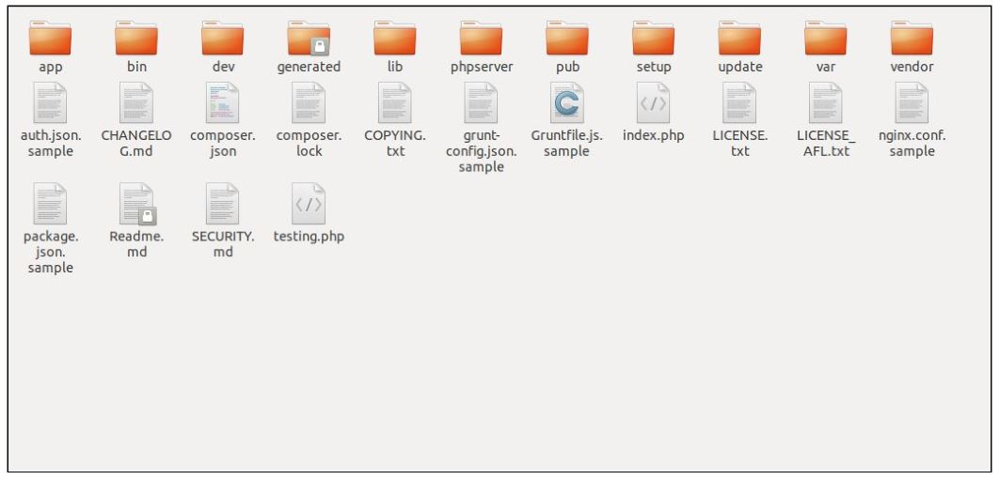
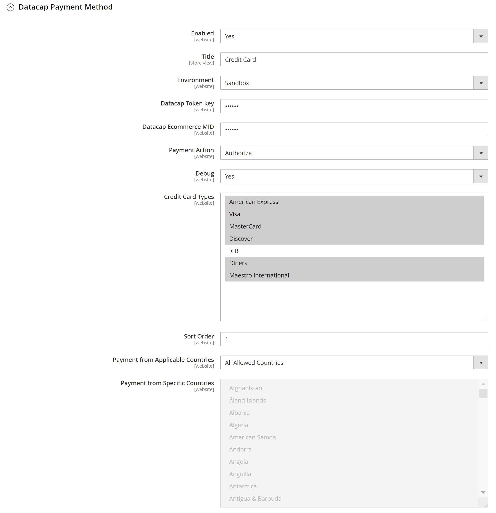
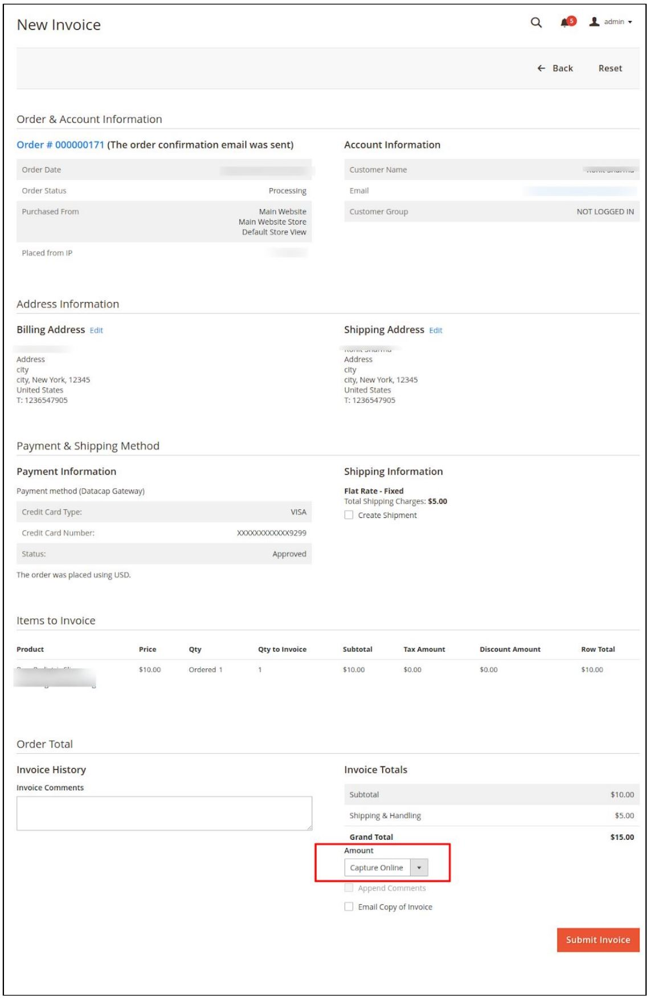

# Datacap Magento Module

Datacap's Magento Commerce Plugin for NETePay Hosted

## Installation Steps

1. Go to the Magento root directory

2. Place the Datacap Magento app directory in the Magento root directory.
3. Enter the following at the command line:

```
php​ ​bin/magento​ ​setup:upgrade
php​ ​bin/magento​ ​setup:di:compile
php​ ​bin/magento​ ​setup:static-content:deploy
```

## Admin Configuration
1. Go to the Magneto Admin Panel
2. Select Store => Configuration
3. Select Sales => Payment Method

Here you'll find the settings to configure the Datacap Magneto plugin. 



1. Enabled

   This option enables/disables the Datacap payment method for the store.

2. Title

   The display name of the Datacap payment option presented to the customer at checkout.

3. Environment

   Either Sandbox (test) and Production

4. Datacap Token Key and Ecommerce MID

   Credentials provided by Datacap for Ecommerce processing.

5. Payment Action

   Choose either:

   1. Authorize

      The amount is authorized during checkout, but captured when the invoice is generated in the Admin Panel.

   1. Authorize and Capture

      The amount is authorized and captured during checkout, and an invoice is created automatically.

## Capture an Authorized Amount / Generate an Invoice

1. Go to the Magento Admin Panel
2. Select Sales => Order
3. Select an order to invoice
4. Click the Invoice option from the top navigation bar
5. At the bottom of the invoice under Invoice Totals, you will see an option to Capture Online
6. Click the Submit Invoice button




## Issue a Refund / Return

To issue a refund, you first need an invoice. Follow the steps above to generate the invoice, then follow the steps below:

1. From the Magento Admin Panel, select Sales => Invoices
2. Select the invoice to refund
3. Click the Credit Memo option in the top navigation bar
4. At the bottom of the invoice, you will see options to Refund or Refund Offline (cash refund)
5. Click the Refund button to issue a refund to the payment card. 


## Report bugs

If you encounter any bugs or issues with the latest version of the Datacap Magento plugin, please report them to us by opening a [GitHub Issue](https://github.com/datacapsystems/Magento/issues)!